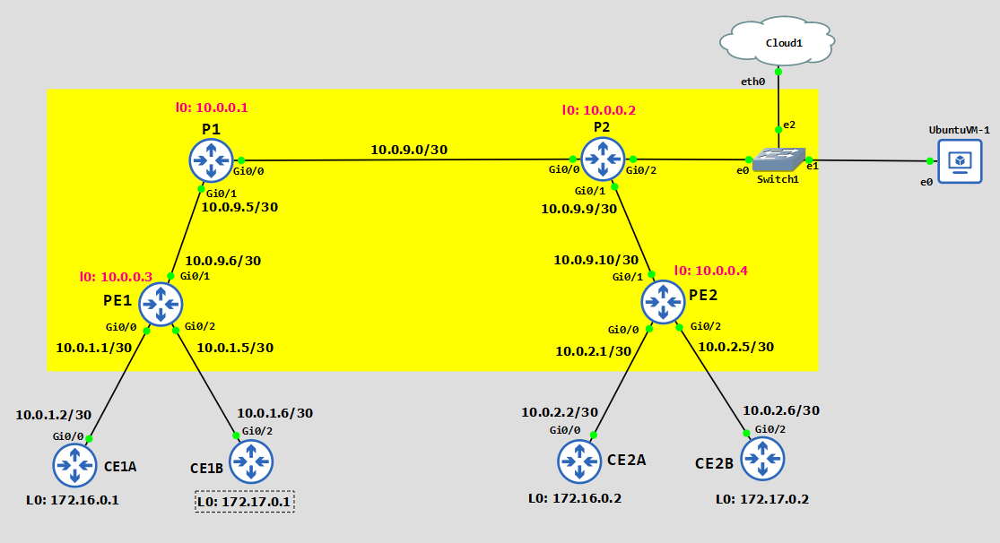
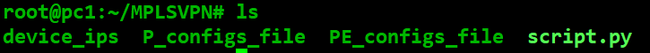
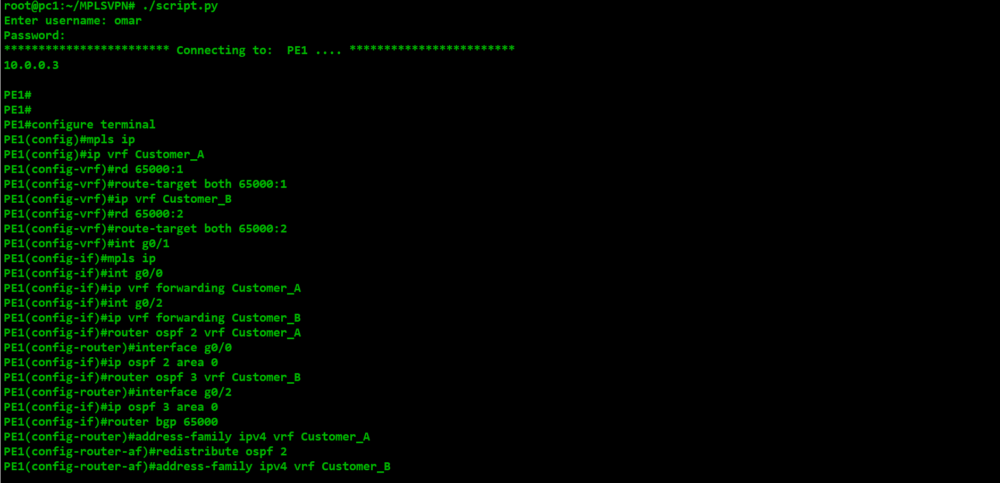
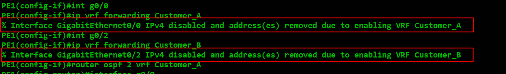
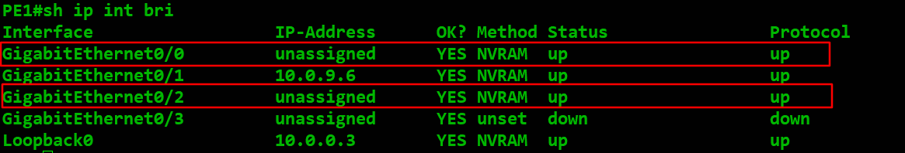
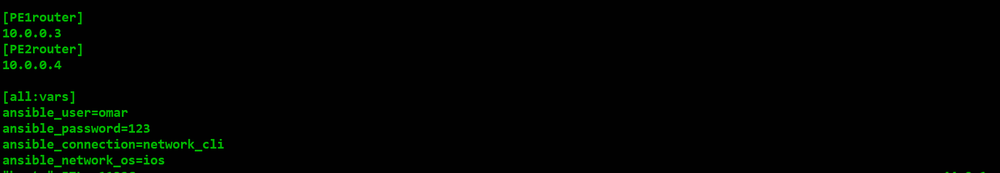
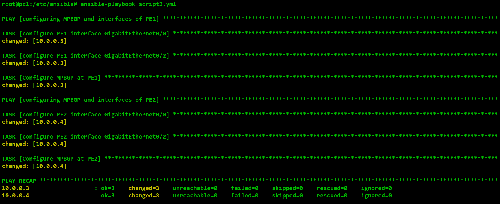
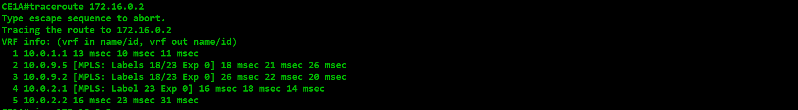

 # MPLS-VPN--LAB
A simple demo of automating MPLS VPN configurations using python and Ansible.

### LAB overview

In this lab the initial configs are as follow:
* Configure all interfaces with corresponding IPs as in the diagram.
* Between Provider routers I've build an ospf neighborship with a PID of 1.  
* Enable `SSH` on (PE1, PE2, P1, P2).
* At **CE1A** and **CE2A** I've configured ospf with a PID of 2.
* At **CE1B** and **CE2B** I've configured with a PID of 3.

### Python side of configuration:
* This code is used to configure MPLS, VRF and add each interface to its corresponding VRF, also redistribute OSPF routes into BGP and vice versa all of this at PE1 and PE2 as you can see in [PE_configs_file](https://github.com/m-omar628/MPLS-VPN--LAB/blob/main/config_files/PE_configs_file) and for P1 and P2 I just enabled MPLS as you can see this in [P_configs_file](https://github.com/m-omar628/MPLS-VPN--LAB/blob/main/config_files/P_configs_file).
* Also this code use [devices_ips](https://github.com/m-omar628/MPLS-VPN--LAB/blob/main/config_files/devices_ips) file to ssh to the devices.

At the beginning i've created a directory contains script.py, PE_configs_file, P_configs_file, devices_ips

In this script, I've used  `netmiko` library to ssh to the devices and send configs to them.
* You can check this [link](https://pypi.org/project/netmiko/) for more information about `netmiko`

When you run this script you should see something like this:

Also as you know when adding an interface to a VRF its IP is wiped out and we need to add it manually but we won't :D as we'll configure these interfaces using **Ansible** as we will discuss in the Ansible part.

So when running this script you will see these Syslog messages:

And to verify this when we travel to PE1 for example and issue `sh ip int bri` you see that the two interfaces connected to CE1A and CE1B don't have an IP address:

**P.S.** the same will happen at PE2.

And now it's time for Ansible playbook to solve this issue!!! :D

### Ansible side of configuration:
* You can chick this [link](https://docs.ansible.com/ansible/latest/installation_guide/intro_installation.html) for `Ansible` installation.

For `Ansible` playbook, it will reassign IP addresses to PE1 and PE2 interfaces (that have been added to VRF) and also build `BGP` neighbourship between PE1 and PE2.

But before we run the playbook we first have to add the users' group to the hosts' inventory file so it will be something like this:

When you run the playbook and if everything working well the output of the playbook should look like this:

**And know we almost reached the end :D, but now let's do some verifications:**
Let's take **CE1A side** for the verification process:
* First let's issue `show ip route ospf` and you'll see that it only knows CE2A routes :

* Also if you issue `traceroute 172.16.0.2` you will see:

**P.S.** you can issue `no mpls ip propagate-ttl` at all provider routers to hide the P1 and P2 routes from the trace result.
